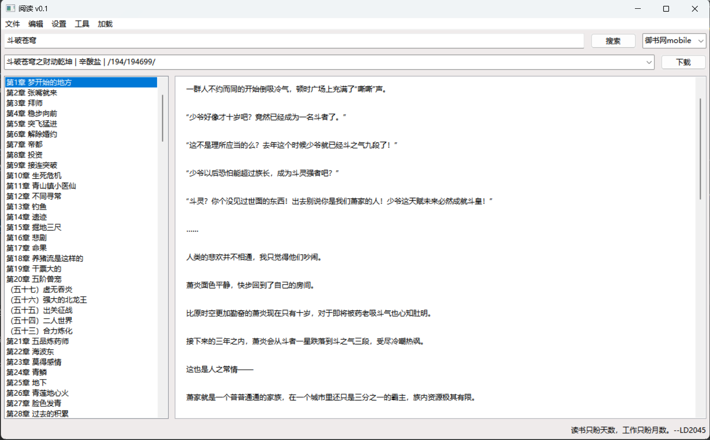
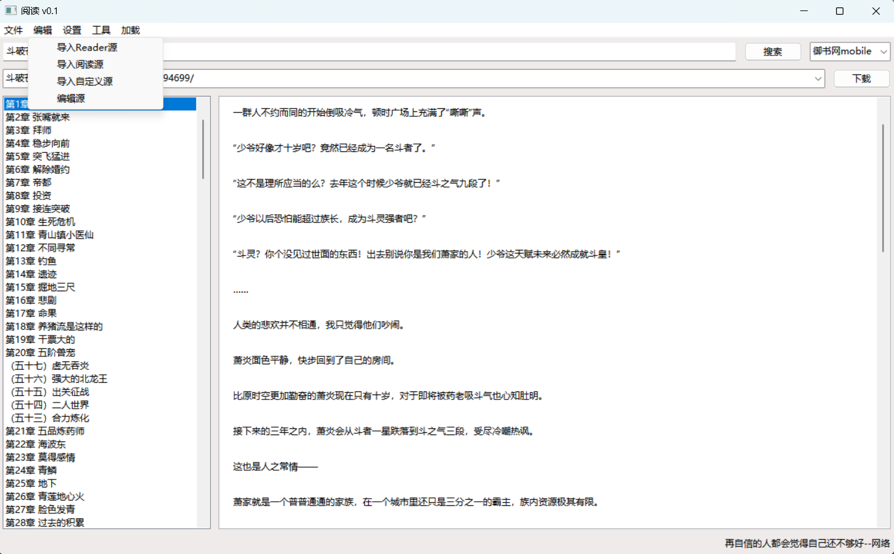

# 开源阅读器

一个跨平台的开源电子书阅读软件，支持多书源、在线阅读与本地缓存下载。

适配多种阅读数据源，支持自定义源。

---


---

## 软件界面

阅读界面：



书源导入：


---

## 功能特性

- 基于 wxPython 开发，界面轻量与易扩展
- 适配 Reader 源  
 参考项目: https://github.com/binbyu/Reader  
- 支持自定义书源格式
- 支持 Windows 与 Linux

---

## 自定义书源

支持配置与导入自编写的书源

---

## TODO

- 支持阅读源格式  
- 优化搜索与内容加载体验  
- UI 主题扩展  
- 阅读进度云同步  
- 计划支持 MacOS
- 本地缓存下载  
- 多书源支持 
---

## 构建与运行

```
pip install -r requirements.txt
python main.py
```

---

## 交流与反馈

欢迎提交 Issue 与 Pull Requests 一起完善软件

---

## 许可证

本项目遵循开源许可协议，支持二次开发和分发
